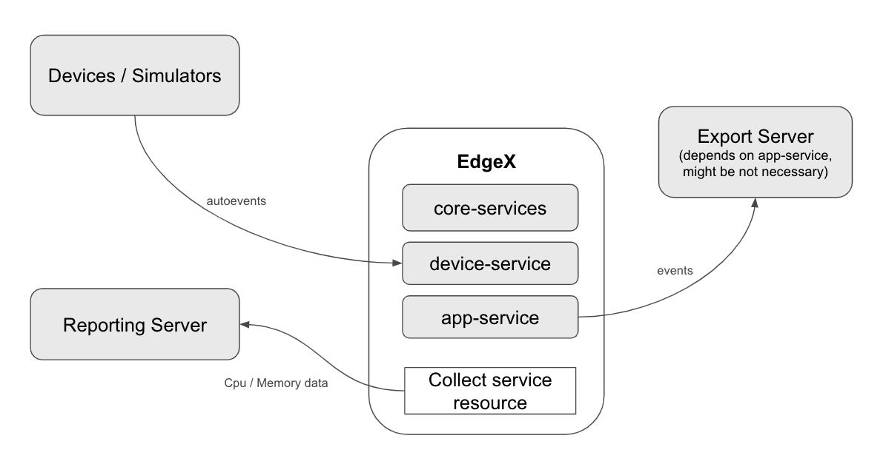

## Performance Test

## Submitters
- Cherry Wang (IOTech)

## Changelog
<!--
List the changes to the document, incl. state, date, and PR URL.

State is one of: pending, approved, amended, deprecated
Date is an ISO 8601 (YYYY-MM-DD) string.
PR is the pull request that submitted the change, including information such as the diff, contributors, and reviewers.

E.g.:
- [approved](URL of PR) (2022-04-01)
- [amended](URL of PR) (2022-05-01)
-->

## Market Segments
- All

## Motivation
The EdgeX Performance Test aims to evaluate the efficiency of the EdgeX services in handling a large volume of data transmission from the south side to the north side in a manufacturing context. This use case is motivated by the need to understand how EdgeX performs under heavy data loads and to identify potential areas for optimization.

## Target Users
- Software Developer
- Software Integrator

## Description
The EdgeX Performance Test involves the south side generating a substantial amount of data and transmitting it through EdgeX services to the north side. This process aims to simulate real-world scenarios where data flow between manufacturing devices and backend systems is intensive. The observation of this data transmission allows for an in-depth analysis of EdgeX's resource utilization patterns.

## Existing solutions
There are no existing solutions.

## Requirements
<!--
Provide a list of (non-)functional requirements that aren't addressed by EdgeX. 
Include security and privacy requirements that are specific to the given domain.
If appropriate, report requirements as feature requests on corresponding EdgeX projects and provide the URLs.

Format:
- Summary of the requirement ([repo#issue-num](URL))
-->
- Prerequisite:
    - Prepare device and app-service profile template
    - Define amount of devices and app-services on configuration file, ex. 10 devices per profile and 10 app-services.
- Scenario:
    1. Setup devices or simulators on device machine 
    2. Generate devices and app-services based on templates and configuration file and put device and profile yaml files under /res of device-service
    3. Deploy EdgeX with core-services, device-service and app-service
- Real-time monitoring of resource utilization during data transmission by tooling, ex. Telegraf with InfluxDB/Grafana

## Related Issues

## References
<!--
List additional references

Format:
- [Title](URL)

The following are references used to create this template:
- https://iot-analytics.com/iot-market-segments-analysis/
- https://www.w3.org/TR/wot-usecases
-->
